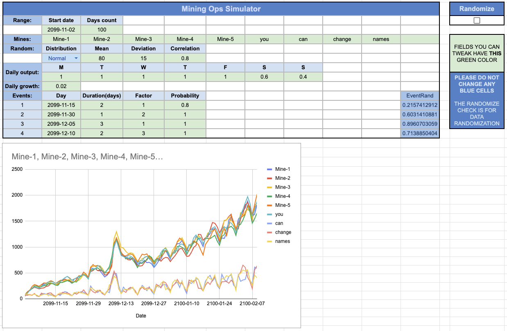

# Weyland-Yutani Mining Operations

*A data-engineering exercise, cleaned up and documented as a portfolio piece.
"Weyland-Yutani" is the fictional corporation from the* Alien *films, used as the
task's theme.*

A two-part synthetic-data system:

1. **Generator** - a Google Spreadsheet that produces *realistic* (not random-noise)
   daily mining-output data using only cell formulas.
2. **Dashboard** - a Streamlit app that ingests that data, computes statistics,
   detects anomalies with four configurable tests, and exports a polished PDF report.

**[▶ Live dashboard](https://amelylina-weyland-yutani-mining.streamlit.app)**  ·  **[📊 Data generator (Google Sheet, view-only)](https://docs.google.com/spreadsheets/d/1wIp2u8EmsLTKW3AWGoaReJvmqbmGurhSRXKDcw5kf0Y/edit?usp=sharing)**

---

## Part I - The data generator

The generator lives entirely in spreadsheet formulas (no scripts), so anyone can
open it, adjust parameters, and watch the data and chart update live. It's designed
so the output *looks* like real mining data rather than white noise.



Editable parameters (the green cells; blue cells are locked formulas):

- **Mines** - count and names
- **Date range** - start date and number of days (validated, max 365)
- **Distribution** - uniform or normal, with mean / deviation
- **Correlation** - a smoothing factor that links each day to the previous one,
  so the series drifts instead of jittering randomly
- **Day-of-week factors** - a multiplier per weekday for periodic patterns
  (e.g. reduced weekend output)
- **Daily growth** - an overall upward/downward trend
- **Events** - up to four spike/drop events, each with a date, duration, magnitude
  factor, and probability, shaped with a bell curve

The **Randomize** checkbox drives the underlying `RAND()` calls. Because the sheet
is published as CSV and `RAND()` is the only fast cell way to randomize, **every
refresh regenerates the data** - the dashboard embraces this with a manual *Refresh*
button and a debug toggle to inspect exactly what was fetched.

> The sheet is shared view-only. Reach out if you'd like edit access to experiment
> with the parameters.

## Part II - The dashboard

Built with Streamlit + Plotly. For the total output and each mine individually:

- **Statistics** - mean, median, standard deviation, interquartile range
- **Anomaly detection** (toggle any combination, all parameters adjustable):
  - IQR rule (k multiplier)
  - Z-score (σ threshold)
  - Moving-average deviation (window + % threshold)
  - Grubbs' test (significance α)
- **Charts** - Line / Bar / Stacked, with anomalies highlighted and an optional
  polynomial trendline (degree 1–4)
- **Anomaly table** - every flagged day and which test(s) caught it
- **PDF report** - one button generates a formatted report with tables, charts,
  and a per-mine breakdown of anomaly events

## Running locally

```
pip install -r requirements.txt
streamlit run app.py
```

Streamlit opens http://localhost:8501 automatically; visit it manually if not.

By default the app reads from the published generator sheet, but you can paste any
compatible published-CSV URL into the sidebar.

## Project structure

```
app.py            Streamlit entry point / layout / sidebar controls
src/data.py       fetch + clean the CSV feed
src/stats.py      summary statistics + the four anomaly tests
src/charts.py     Plotly chart builders (line / bar / stacked, trendlines)
src/ui.py         per-tab rendering (stats cards, charts, anomaly tables)
src/pdf.py        PDF report generation (ReportLab)
src/config.py     defaults, branding colors, anomaly-parameter dataclass
generator/        the Google Sheets generator (screenshot + write-up)
```
